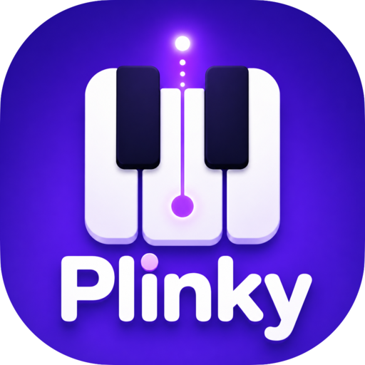

<!--
SPDX-FileCopyrightText: The Plinky Authors
SPDX-License-Identifier: 0BSD
-->

<p align="center">
  
</p>

<p align="center">A beginner-friendly piano trainer that turns practice into a game.</p>

---

Plug a digital piano into your browser and Plinky guides you through a score — you
read the notation, play it over MIDI, and it grades how you do. No piano handy? Play
along on your computer keyboard or the on-screen piano instead. Everything runs in
the browser; nothing is uploaded, and your scores stay on your device. And if that
device's storage ever fills up or gets blocked, Plinky says so — a banner warns that
progress isn't being saved, and saving a take tells you when it didn't land instead
of pretending it did.

## Practising a score

Open any score and Plinky renders it as real notation, led by a single action:
**Practice**. Pressing it drops into **full screen** — the score and keyboard to
themselves, the screen kept awake (and on a phone the browser's URL bar reclaimed for
the music) — and starts a note-by-note guide: read the note, play it, and the cursor
advances, sounding it back the way you played it — a quick tap sounds **staccato**, a held
key **sustains**, and how hard you strike sets how loud it sings. That works on a MIDI
piano, the on-screen keys, or your computer keyboard, no pedal required. On the on-screen
piano, striking a key nearer its tip plays it louder, so even a tap has dynamics. Hold a
key on the on-screen piano and slide across the keybed and the notes glide from one to the
next, the way a thumb dragged across real keys does — and the whole keybed plays with a
screen reader and arrow keys too, not only a mouse or finger. Full screen is
where the rest of the play controls live, so it's the same generous surface on a phone or
a wide desktop alike.
There you'll also find **Listen**, which plays the piece back so you hear it first,
lighting up each note as it sounds so your eye can follow along. Listen plays it the way
it's written — **staccato** notes clipped short, **slurs** flowing legato, **accents**
struck harder, and the **dynamics** (soft to loud) shaping each note — with tied notes
held rather than re-struck. Listen and Practice
**hand off to each other** — let the computer play a tricky passage then take over
mid-phrase, or play a while and hand it back — and your place is kept, even if you
step out of full screen and come back to it; the **restart** control (or finishing
the run) returns you to the top. The notes keep their colour as you switch, so the
score tells the story of how it was played — **blue** where the computer played,
**green** where you did. The
staff **scrolls to follow the cursor** as you go, so a multi-line piece keeps up with
you instead of making you scroll — and it stays in its own box so the keyboard below
never hides the notes. On a phone — in either orientation — a compact **focus strip**
sits right above the keys showing the bar you're playing, so the notes you need are
never out of reach. An **(X)** leaves full screen, **restart** takes the run back to
the top, and a **Set up** button slides in the same setup panel you get before a run,
so every reading aid and layout choice is a tap away mid-piece without a row of icons
crowding the music.

That setup panel — before a run and behind the full-screen **Set up** button alike —
reads like the Settings page: each theme in its own titled card that explains itself.
**Skill level** leads, one choice that sets the reading aids below to match you (tweak
any and it reads Custom); then **how you play** (which hand, keep-up, the metronome),
the **reading aids** (colour, the notes highway, hidden notes, finger numbers), the
**score layout**, and an **extra challenge** group. In the layout group you can turn
**follow the note** on or off (the score scrolls to keep the note you're on centred),
force a **set number of bars per row** for bigger, more readable notation on a
small screen, or switch to **treadmill** reading — the piece laid out as one continuous
line that scrolls under a fixed gaze as you play, so your eyes rest in one place. Turn on
the **notes highway** and the staff gives way to a tall lane of the upcoming notes,
descending in each key's column toward the keys as you play (Synthesia-style, two hands
coloured apart) — so a beginner can see which key comes next without decoding the staff;
it advances by position, so it stays self-paced.
**Bar
numbers** on each row's first bar make a passage easy to find (and line up with the
loop's from/to), or you can turn them off for a cleaner staff. **Beams** — the bars
that join fast notes into beat groups — can be hidden so a beginner reads one note at a
time, shown, or left on **Auto**, which draws them on harder pieces where the beat
grouping helps and drops them on the easy grades. A **note-size** control magnifies the
whole score — bigger, easier-to-read glyphs on a small screen or for a beginner, and it
works in treadmill mode too. The notes are **coloured** by name out of the box — every C red,
every D orange — so a beginner reads pitch by hue while the names sink in; turn it off once
you don't need it. The played/heard feedback rides
behind the notes as a soft highlight, so the colours stay clear as you play. A
wrong key flashes red; whether the correct key then lights up is your call — by
default it always shows the next note, or you can ask for a nudge only after a slip,
or read the music unaided. When the next note is shown, playing it leaves a fading
fill on the key for as long as the note is written to last, so you can see how long
to keep holding — not just which key to press. A single **Skill level** picks all
these reading aids together — from a new starter with every help on to a sight-reader
reading the bare staff — and you can still fine-tune any of them; it sits in both the
run panel and **Settings**, which now hold the same reading preferences, so wherever
you reach for them they're the same set. Your hand size, key mapping, and sound are
personal and a level never touches them.
Single notes, **chords**, and **two-hand grand staffs** all work the same. Turn on
**Loop** and the piece repeats whole; to drill just a passage, **tap two bars on the
score** — they fill **red** so the stretch you're repeating is clear, and the range
(with a *Whole song* reset) sits right beside the score, so you can also set the first
and last bar by number. Turn on
**Keep going** and a missed note no longer freezes you — playing the next one moves the
score along, so one hand's slip never stops the other. And for ear training, turn on
**Hidden notes**: the noteheads start blank (the staff and rhythm stay), you Listen to
the phrase first, and each note reveals itself as you find it — **green** when you get
it, **red** once your tries run out (1 by default, up to 3), so the score you finish
with is the story of what your ear caught.

Right in full screen, a **finger-positions** button swaps the keyboard for a fingering
editor: every note arrives pre-fingered with the optimal choice for your measured hand
span, and you tap a note then one of the **ten fingers** below to override it — saved
per piece, with the green/amber/red flow feedback always on. While it's open the score
washes its bars red by **fingering difficulty**, a heat-map that shows at a glance
where the piece actually gets hard — spot the deep-red bars, tap them into a loop, and
drill exactly there. A genuinely easy piece stays clear (nothing to flag), while a
uniformly hard one glows throughout rather than washing out.

Practice is self-paced by default, but flip on **Keep up** and it becomes tempo-locked:
after a one-bar count-in, the cursor advances on the beat whether or not you're ready, and
any note you don't catch before it passes is a miss (Synthesia / Guitar-Hero style). The
notes sound as a guide so you can follow along by ear — or turn that off to read them at
tempo yourself. At the end it tells you how many you kept up with.

On a two-hand piece, pick **one hand** to practise and the run waits only on that
hand, skipping the stretches where only the other sounds. Turn on **Play the other
hand** and the app fills that hand in for you — on the beat during **Keep up**, and
in self-paced practice **note by note at your own pace**: each note you play lays out
the other hand up to your next one, so it plays a duet with you and never runs ahead.

When you finish, a short **major flourish** plays to mark the moment — landing a
beat after your last note so it reads as a reward rather than a sound on top of your
playing. A fuller arpeggio marks a stronger grade, a warm lift a gentler one, never a
downer (it follows the sound setting, so muting silences it). The run is then **graded S–F**
from three things:

- **Accuracy** — how many notes you found cleanly.
- **Timing** — how evenly you held the rhythm. Practice is self-paced, so timing is
  judged against your *own* tempo — a steady run at any speed reads as in time, and
  only a note that breaks your pace counts as off. Tapping on a phone or computer
  keyboard can't be as precise as real keys, so those get a wider window.
- **Flow** — whether you kept moving like a musician rather than stopping to hunt.

A **per-note strip** and a **tempo graph** then show where you rushed or dragged, and on
a two-hand piece a line calls out **which hand lagged** (or that they kept pace). You
can **race a ghost** of your previous best — or a friend's run, shared by link —
with a marker tracking along the staff. Once you clear a score it enters **spaced
repetition**, resurfacing for review on a widening schedule so it actually sticks — a
one-tap **review session** walks you through everything that's fading, and you can
**shelve** anything you're not working on right now.

## Modes

- **Library** — the catalogue: bundled scales, arpeggios, and familiar tunes like
  *Twinkle, Twinkle* and *Ode to Joy*, plus anything you import, in two tabs.
  **Search** finds something to play: search, star, filter by kind, grade, or what's
  **due now**, and open one to practise. **Manage** grows and safeguards the library:
  add your own MusicXML score (drag-and-drop, with a staff preview and editable
  details), download a backup of your imports — or the **whole local library
  including Plinky's built-in pieces** — and restore from a bundle. Each piece credits
  its **licence and source**. Every piece is commercially usable — public-domain, CC0,
  CC-BY or CC-BY-SA (shipped unmodified, so the ShareAlike terms stay satisfied) — so the
  catalogue clears a paid tier. It is drawn from
  [PDMX](https://github.com/pnlong/PDMX) and the CC0
  [OpenScore Lieder](https://github.com/OpenScore/Lieder) corpus, solo-keyboard pieces
  from the [Mutopia Project](https://www.mutopiaproject.org) (public-domain, CC-BY and
  CC-BY-SA), and public-domain choral works from [CPDL](https://www.cpdl.org) (Palestrina,
  Victoria, Byrd, Tallis…) reduced to a two-staff piano grand staff — each credited under
  its own licence, linked from the play page.
- **Daily challenge** — one freshly generated phrase, the same for everyone that day,
  graded and shareable as a "Plinky #N" grid; play it whenever you like, with no
  streak to keep up. An unplayed day arrives as a little present to open; once
  played, re-opening the day's challenge shows your result again. Like any piece, the day's phrase leaves through the title line's **Export
  menu** — print it, or download it as MIDI or MusicXML, each option explained in
  plain words. A **Warm up** tab drills unlimited fresh phrases to prepare for it.
- **Compose** — improvise freely and Plinky captures every note, sketching it onto
  a staff to share or export (see below). **Count in** works like a play page's
  Practice: it drops into **full screen**, and only there do the on-screen keys
  appear — with the same quick controls as play to relabel or fold them away.
- **Ear training** — a page of its own at `/ear`, for the days you're nowhere near a
  piano. **Intervals** plays two notes and you name the distance between them on a
  ladder whose rungs sit at the distance they name, so the answer has a height as well
  as a word; the levels start on fifths and octaves and fill the ladder in as you go.
  **Chords** plays a chord and you name its quality; **Scales** plays a scale and you
  name which one it is — both from a grid of choices, climbing from the major/minor pair
  out to the sevenths, the modes and beyond. **Chord progressions** plays a run of chords
  in a key and you name each in order by its Roman numeral, building the sequence chord by
  chord. Three **functional** exercises play a short cadence to plant a key first, then ask
  you to hear against it: **Scale degrees** (name where one note sits in the key),
  **Intervals in context** (name an interval with the key to lean on), and **Melodic
  dictation** (write a little tune down degree by degree). **Perfect pitch** plays one note
  and you name it on a keyboard. Every round can be
  replayed as often as you like, and a miss shows what played rather than marking you
  down. A round is ten questions, and finishing one **counts toward your grades** the
  same way playing a piece does — each exercise sits on the grade ladder, so ear practice
  lifts the same standing and skill rating, and an exercise you've learned **resurfaces in
  your review queue** on the same widening schedule as a piece, running its drill in place
  of a score. Three collectible achievements come with it: opening your ear, a flawless
  round, and mastering every ear exercise.
- **Two tabs per piece** — **Play** holds the score and everything you do with it:
  reading, listening, practising, playing by ear (the **Hidden notes** toggle, which
  blanks the noteheads and reveals each one as you find it) and the **fingering
  editor** in full screen (see above), so the drills happen on the real music instead
  of in separate tabs. **Runs** keeps your saved performances.
- **Your runs** — every play page has a **Runs** tab (and a button beside Practice
  that jumps to it) giving your saved performances the whole page, so the feature is
  there to find before you've saved a thing: with nothing yet, it tells you how to make a run (play a piece through, then save
  it). Each piece keeps your last few, each showing the **grade and the accuracy, timing
  and flow** it earned so you can compare attempts at a glance: **replay** one and it plays
  back onto the staff in your own timing — on a MIDI piano, even how long you held each key
  and every press of the **sustain pedal**, so a note you pedalled rings on in the replay
  just as you played it — **download** it as MIDI or MusicXML, **save it as
  a video** (an MP4 of your take: the sheet music of what you played with each note
  tinting as it sounds, above the keyboard where each press lights its key in full
  and fades while held, so even fast repeats read clearly — with the piece's title, composer
  and licence burnt in, ready for any chat or feed — offered on browsers that can encode
  one, Chrome and friends today — pick **16:9 or 9:16** right beside Save, choose the
  **style** — the **Staff** sheet music or a **notes-highway** of blocks falling onto the
  keys (Synthesia-style, sized by how long each note is held) — and switch the
  **title** or the **plinky.fun watermark** off if you'd rather (the composer-and-licence
  credit always stays)), **challenge a
  friend** to race it by link, or delete it. From the top of the tab you can **challenge
  a friend with your last run** straight away, no save needed. Your fastest complete run is
  the **ghost** you race next time — racing is on by default and toggles off under the
  score's practice options.
- **Assignments** — a built-in **First steps** set (the demo tunes, then the easiest
  studies) is ready to play on day one; beyond it, build an ordered practice list for
  a student (or yourself): browse
  or search the whole catalogue page by page, add pieces, drag titles into the
  right order (or use the arrow buttons), and give each an optional target tempo
  and note, plus a free-form description for the whole set. The page splits into
  two tabs — your assignments, and the one you're creating or editing. Save it,
  **edit it later**, share it by link, or pass it around as a file; each piece
  checks off as it's learned. A step whose piece is no
  longer on the device (a deleted import, a link from elsewhere) is labelled as
  missing instead of leading to a dead end, and a one-tap action prunes those steps;
  importing a shared assignment says up front how many of its pieces resolve here,
  and deleting a score from the Library warns when saved assignments still use it.
- **You** — your one progress page: the grade you're at on the eight-grade ladder and
  what's left to reach the next, your skill rating, days practised and notes played, a
  slow-moving fingerprint of your Accuracy, Timing and Flow, and the
  pieces **due for review** — with a one-tap review session to refresh them. Each grade
  carries an optional *About this grade* note.

On the **home page**, a gentle, dismissible **Getting started** checklist explains how
Plinky works and walks the first session in order — set yourself up (connect your MIDI
piano in Settings, then hand size and key mapping, so everything after is tailored to
you), then play your first piece (your
first assignment when you have one) — before pointing out the app's other corners. The
steps that put your fingers on keys right away carry a small **Jump right in** marker,
the shortcut for anyone who'd rather play first and configure later. The **Today**
panel alongside it lists the day's practice as one-tap links — pieces due for review,
the daily challenge, and **your open assignment's next step** ("Continue *First
steps* — step 2 of 5"), which goes straight into that piece; while an assignment is
open, its next step stands in for the generic something-new suggestion, so the path
you (or your teacher) chose is always one tap from the front page. The first time you
open a score a one-time tip explains the three modes and the listen-then-play-slowly
loop — a guided tour where you land, never a gate on progress.

## Composing

Play whatever you like — on a MIDI piano, your computer keys, or the on-screen
keyboard — and Plinky records every note and sketches it onto a staff as you go. The
playback is exactly what you played; the staff is an approximate sketch, snapped to a
grid so it reads as notation, with simultaneous notes drawn as chords. Play along to
the **metronome** with a one-bar count-in for a tidier rhythm, set a **checkpoint** to
keep the good part and retry the tail, then **share the take by link** or download it
as **MIDI** or **MusicXML**. Open a MIDI or MusicXML file back in to pick up where you
left off on another device.

## Sharing

Every graded run can become a **Wordle-style grid** — six moments in five colour bands,
no numbers — to copy, post, or save as an image. Each cell folds Accuracy, Speed and
Timing into one square, coloured by the **weakest** of the three, so a moment is only as
good as its shakiest aspect. Unlike the practice grade, which stays gently self-paced,
the card is an honest snapshot: Speed scores how close you played to the piece's own
tempo, so a slow, careful run (a mouse plodding across the on-screen keys) shows red even
with every note right. And it's **one row per hand** — a single row for a one-hand piece,
a **right** row over a **left** row once both hands are in play, so a lagging hand shows
as a redder line against the other. The daily challenge shares as **Plinky N**, so
everyone compares the same run, and the You page shares your lifetime fingerprint of the
practice grade (Accuracy, Timing and Flow).

Earned moments also surface their own **milestone card** on the run summary — your
first S on a piece, reaching a new grade, or a flawless run — to share or save. Each
appears at most once and never interrupts; it just waits beside your results. All of
them land permanently on the You page's **Achievements** shelf: every grade you've
ever reached, your first bronze/silver/gold star, the first S, the flawless run, and
cumulative days-played and notes-played targets — unearned badges stay visible as
goals, and taking a break never removes one.

## Bring your own scores

Drag in a **MusicXML** file (`.musicxml`, `.xml`, or compressed `.mxl`) exported from
MuseScore, Sibelius, Finale, or Dorico, and it joins your catalogue — playable and
graded like any other, saved on your device. Preview the staff, set its grade and
details, then add it. Export your whole library as a pack to back it up or hand it to
a student.

## Playing

- **With a digital piano** — connect it over USB or Bluetooth MIDI and click
  *Connect MIDI*; Plinky reconnects it automatically on your next visit. Web MIDI is
  available in Chrome, Edge, and Firefox on desktop and Android; Safari and iOS do
  not expose it — there, let Plinky listen instead (below) or use the keyboard fallback.
- **With an acoustic piano (or any piano, no cable)** — start **listening** in
  Settings and Plinky hears your playing through the microphone, one note at a
  time, feeding the same practice flow a MIDI keyboard does. Pitch heard from a
  room is wobblier than a wire, so mic runs are graded with the same generous,
  widened timing windows as the keyboard fallbacks — it should feel encouraging,
  never picky. Works everywhere a microphone does, including Safari and iOS.
  For the clearest hearing, run **Tune to your piano** once from Settings: a short
  guided wizard listens to your room, asks you to play middle C, then a soft and a
  firm note, and remembers a tuning for that device — its noise floor, octave and
  loudness — so soft notes aren't missed and a quiet or bright piano still reads true.
- **With your computer keyboard** — the bottom letter row plays the left hand
  (`Z X C V B N M` the white keys, `S D G H J` the black) and the top row the
  right hand an octave up (`Q W E R T Y U` white, `2 3 5 6 7` black), each a full
  C-to-B octave, with an octave shift to move around; remap any of these keys to
  your own layout in **Settings** — where you can also bind a spare key (one no note
  uses, Space included) to each of the three **pedals** (sustain, sostenuto, soft), so a
  computer-keyboard player can hold the sustain pedal just like a pianist. (Two-hand pieces span both staves,
  so a MIDI keyboard is the comfortable way to play those.)
- **With the on-screen piano** — tap the keys shown under each score. On a wide-ranging
  piece the keyboard shows a moving window that follows the notes you're playing, so the
  keys never shrink to slivers; set its width — **1, 2 or 3 octaves, or the whole piece**
  fixed — in the *Practice tools* drawer. Handy on a phone or tablet with no MIDI or keyboard.

Still learning where the notes are? The keys can carry their **note names** — every key,
or just the C keys as orientation landmarks (the white key left of each pair of black
keys), or none once the map is second nature — set under **Settings**. Every key is
labelled by default, so a first-timer can find any note straight away.

Every keyboard shows a small badge in its corner — a green tick the moment a MIDI
piano is connected, a quiet plug otherwise — so you can see at a glance whether your
instrument is hooked up.

Sound is synthesised in the browser, so the on-screen and computer keyboards make
sound everywhere — MIDI is only for *input* from a real piano. iPhones normally mute
browser audio under **Silent Mode**, so Plinky declares itself a playback audio
session (iOS 16.4+) to play through it like a music app, and re-wakes sound after a
call or app switch interrupts it. On an older iPhone, or if you still hear nothing,
turn Silent Mode off (the side switch, or the Action button on iPhone 15 Pro and
later) and turn the volume up — Plinky shows a one-time reminder on iOS. Opening
Plinky from inside a social app (Instagram, TikTok, Facebook, …) runs it in an
embedded browser that blocks sound outright; there the reminder points you to open
the page in Safari instead.

Plinky installs from your browser like an app and works offline once loaded. When
a new version ships it waits quietly rather than reloading mid-task: a banner
offers it, and the app updates only when you choose to reload. Even when an
update arrives from another tab, a reload never interrupts a run in progress —
it waits for the run to finish. And if updates can't be installed on a device at
all, Plinky says so in a dismissible notice instead of silently falling behind.

## How it works

A single-page app built with [React Router](https://reactrouter.com) in SPA mode.
[Web MIDI](https://developer.mozilla.org/docs/Web/API/Web_MIDI_API) delivers note
input and [Web Audio](https://developer.mozilla.org/docs/Web/API/Web_Audio_API)
drives playback from one shared audio clock.
[OpenSheetMusicDisplay](https://opensheetmusicdisplay.org) renders MusicXML, and
Plinky walks its cursor to match the pitches under each position against what you
play — the same engine behind every mode.

## Translations

Plinky speaks 26 languages, and contributions are welcome — see
[TRANSLATING.md](TRANSLATING.md) for how to add a translation. Untranslated strings
fall back to English, so every language always works while it catches up.

Plinky talks like a piano teacher who is glad you showed up: it invites rather than
instructs, and never nags about a missed day. [VOICE.md](VOICE.md) is the contract
every string keeps — worth a read before writing copy or translating it, since the
register is part of the string.

## Help page

The **?** in the header opens a help page that explains Plinky area by area — one
section per part of the app, and it drops you on the section for the page you came
from. It works **fully offline**: the copy is bundled with the app (translated with
the rest of the UI, so a reader downloads only their own language) and the section
screenshots ship in `public/help/`.

The app owns the sections and their order; [`core/helpContent.ts`](core/helpContent.ts)
holds the body text for each section in every locale, and a local help adapter joins it
with the screenshots — no network, no external service. Regenerate the screenshots from
the real UI after a visual change with `nix develop --command ci-build` followed by
`nix develop --command node dev/help-screenshots.mjs`, then commit the updated PNGs.

## Composer pages

Every composer credited in the catalogue gets a page at `/person/<name>` —
all of their pieces in one place, easiest first, each one tap from being
practised. The composer's name on a play page links there. Spelling variants
across the source corpora ("J.S. Bach", "Johann Sebastian Bach (1685 - 1750)")
are canonicalized so one composer owns one page.

## Privacy

Plinky collects **nothing**. It is a browser-only app: your settings, progress and
recordings live only in your browser, there are no accounts, no cookies, no advertising,
and no analytics or tracking of any kind. It fetches no content from any external
service, so the whole thing works offline. Every page ends with a slim footer linking to
the German-law Impressum and Datenschutz notices and to the source on
[GitHub](https://github.com/metio/plinky).

## Development

The project builds with Node.js and npm:

```sh
npm install      # install dependencies
npm run dev      # start the dev server
npm run typecheck
npm test
npm run arch     # check the layered-architecture rules
npm run build    # emit the static site to build/client
npm run scores   # regenerate the bundled exercise scores
npm run mutation # measure test quality with Stryker (see below)
```

`npm run mutation` runs [Stryker](https://stryker-mutator.io) over the pure
`core/` layer: it rewrites the code with small faults and reruns the tests, so a
surviving mutant marks an assertion the suite is missing — a gap that line
coverage can't reveal. It is a slow, manual quality check, not part of the CI
gate; the score is ratcheted in `stryker.config.mjs`.

The codebase is a stack of layers — a pure `core/` domain under an app of ports,
adapters, stores and components — described in [ARCHITECTURE.md](ARCHITECTURE.md)
and enforced by `npm run arch`. A pull request runs typecheck, tests, the
architecture check, and a production build; merging to `main` publishes the built
site to <https://plinky.fun>.

## License

[0BSD](LICENSES/0BSD.txt), [REUSE](https://reuse.software)-compliant.
