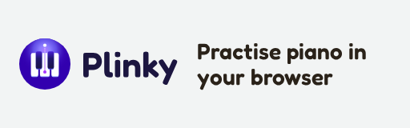

<!--
SPDX-FileCopyrightText: The Plinky Authors
SPDX-License-Identifier: AGPL-3.0-or-later
-->

<p align="center">
  
</p>

<p align="center">A beginner-friendly piano trainer that turns practice into a game.</p>

---

Plug a digital piano into your browser and Plinky guides you through a score — you
read the notation, play it over MIDI, and it grades how you do. No piano handy? Play
along on your computer keyboard or the on-screen piano instead. Everything runs in
the browser; nothing is uploaded, and your scores stay on your device. New versions
install themselves — a fresh build takes over the next time you move between pages or
come back to the tab, never mid-run, and never by asking you to click anything. And if that
device's storage ever fills up or gets blocked, Plinky says so — a banner warns that
progress isn't being saved, and saving a take tells you when it didn't land instead
of pretending it did.

There are no version numbers to wait for — every change goes live as it lands.
[NEWS.md](NEWS.md) says what's changed recently, and what it means for you.

## Practising a score

Open any score and Plinky renders it as real notation. Under the title sits the piece's
**incipit** — its opening bars on a small staff, the way a thematic catalogue names a work,
coloured by note name when you have that reading aid on. The same mark names pieces in
lists: today's practice, the pieces due a refresh, and a composer's whole catalogue. It
ships with the catalogue rather than being read from each score, so a list draws itself
with nothing to fetch. Then a single action leads:
**Practice**. Pressing it drops into **full screen** — the score and keyboard to
themselves, the screen kept awake (and on a phone the browser's URL bar reclaimed for
the music) — and starts a note-by-note guide: read the note, play it, and the cursor
advances, sounding it back the way you played it — a quick tap sounds **staccato**, a held
key **sustains**, and how hard you strike sets how loud it sings. That works on a MIDI
piano, the on-screen keys, or your computer keyboard, no pedal required. On the on-screen
piano, striking a key nearer its tip plays it louder, so even a tap has dynamics. Hold a
key on the on-screen piano and slide across the keybed and the notes glide from one to the
next, the way a thumb dragged across real keys does — and the whole keybed plays with a
screen reader and arrow keys too, not only a mouse or finger. Full screen is
where the rest of the play controls live, so it's the same generous surface on a phone or
a wide desktop alike.
There you'll also find **Listen**, which plays the piece back so you hear it first,
lighting up each note as it sounds so your eye can follow along. Listen plays it the way
it's written — **staccato** notes clipped short, **slurs** flowing legato, **accents**
struck harder, the **dynamics** (soft to loud) shaping each note, **tremolos** shaking,
**glissandos** sweeping, and a ***rit.*** or an ***accel.*** giving in the pulse where the
score asks for one — with tied notes held rather than re-struck. Pieces that print no
markings at all still breathe in phrases, with the tune brought out of the chord under it.
The piano stands in a small **room** you can turn up or down in Settings, and a **recorded
grand** is what you hear by default — its recordings arrive a piece at a time, so nothing is
downloaded before you play. Listen and Practice
**hand off to each other** — let the computer play a tricky passage then take over
mid-phrase, or play a while and hand it back — and your place is kept, even if you
step out of full screen and come back to it; the **restart** control (or finishing
the run) returns you to the top. The notes keep their colour as you switch, so the
score tells the story of how it was played — **blue** where the computer played,
**green** where you read it cleanly, and **amber** where you found the note only after
a wrong key, so a finished piece shows where the run actually hesitated instead of a
uniform green that forgets. The
staff **scrolls to follow the cursor** as you go, so a multi-line piece keeps up with
you instead of making you scroll — and it stays in its own box so the keyboard below
never hides the notes. On a phone — in either orientation — a compact **focus strip**
sits right above the keys showing the bar you're playing, so the notes you need are
never out of reach. An **(X)** leaves full screen, **restart** takes the run back to
the top, and a **Set up** button slides in the same setup panel you get before a run,
so every reading aid and layout choice is a tap away mid-piece without a row of icons
crowding the music.

That setup panel — before a run and behind the full-screen **Set up** button alike —
reads like the Settings page: each theme in its own titled card that explains itself.
**Skill level** leads, one choice that sets the reading aids below to match you (tweak
any and it reads Custom); then **how you play** (which hand, keep-up, the metronome),
the **reading aids** (colour, the notes highway, hidden notes, finger numbers), the
**score layout**, and an **extra challenge** group. In the layout group you can turn
**follow the note** on or off (the score scrolls to keep the note you're on centred),
force a **set number of bars per row** for bigger, more readable notation on a
small screen, or switch to **treadmill** reading — the piece laid out as one continuous
line that scrolls under a fixed gaze as you play, so your eyes rest in one place. Turn on
the **notes highway** and the staff gives way to a tall lane of the upcoming notes,
descending in each key's column toward the keys as you play (Synthesia-style, two hands
coloured apart) — so a beginner can see which key comes next without decoding the staff.
Each block is as tall as its note is long and sits as far up the lane as it is far off in
the music, so a whole note held in the left hand stands over the run of quavers above it.
It advances by position rather than on a clock, so it stays self-paced.
**Bar
numbers** on each row's first bar make a passage easy to find (and line up with the
loop's from/to), or you can turn them off for a cleaner staff. **Beams** — the bars
that join fast notes into beat groups — can be hidden so a beginner reads one note at a
time, shown, or left on **Auto**, which draws them on harder pieces where the beat
grouping helps and drops them on the easy grades. Pieces written for piano
and a singer or another instrument show only your own two staves; **Other parts** brings
theirs back, printed above yours and sounded along with them, and it is never something
you are asked to play. A **note-size** control magnifies the
whole score — bigger, easier-to-read glyphs on a small screen or for a beginner, and it
works in treadmill mode too. The notes are **coloured** by name out of the box — every C red,
every D orange — so a beginner reads pitch by hue while the names sink in; turn it off once
you don't need it. The played/heard feedback rides
behind the notes as a soft highlight, so the colours stay clear as you play. A
wrong key flashes red; whether the correct key then lights up is your call — by
default it always shows the next note, or you can ask for a nudge only after a slip,
or read the music unaided. When the next note is shown, playing it leaves a fading
fill on the key for as long as the note is written to last, so you can see how long
to keep holding — not just which key to press. On the home page, that same keyboard
names what you are holding as you hold it — the note, the interval, or the chord —
so a shape you stumbled on stops being a shape you cannot look up. A fresh device starts at **New starter** — every aid on, the notes highway included,
because someone who has never read music cannot start at the staff — and finishing the
keyboard tour puts you there explicitly. A single **Skill level** picks all
these reading aids together — from a new starter with every help on to a sight-reader
reading the bare staff — and you can still fine-tune any of them; it sits in both the
run panel and **Settings**, which now hold the same reading preferences, so wherever
you reach for them they're the same set. Your hand size, key mapping, and sound are
personal and a level never touches them.
Single notes, **chords**, and **two-hand grand staffs** all work the same. Turn on
**Loop** and the piece repeats whole; to drill just a passage, **tap two bars on the
score** — they fill **red** so the stretch you're repeating is clear, and the range
(with a *Whole song* reset) sits right beside the score, so you can also set the first
and last bar by number. With a loop set, **Show only the looped bars** re-engraves just that stretch on its
own — key and time signature restated, drawn big, with nowhere else for the eye to
go. On a phone it's the difference between practising four bars and hunting for them.
Turn on
**Keep going** and a missed note no longer freezes you — playing the next one moves the
score along, so one hand's slip never stops the other. And for ear training, turn on
**Hidden notes**: the noteheads start blank (the staff and rhythm stay), you Listen to
the phrase first, and each note reveals itself as you find it — **green** when you get
it, **red** once your tries run out (1 by default, up to 3), so the score you finish
with is the story of what your ear caught.

Right in full screen, a **finger-positions** button swaps the keyboard for a fingering
editor: every note arrives pre-fingered with the optimal choice for your measured hand
span, and you tap a note then one of the **ten fingers** below to override it — saved
per piece, with the green/amber/red flow feedback always on. While it's open the score
washes its bars red by **fingering difficulty**, a heat-map that shows at a glance
where the piece actually gets hard — spot the deep-red bars, tap them into a loop, and
drill exactly there. A genuinely easy piece stays clear (nothing to flag), while a
uniformly hard one glows throughout rather than washing out.

Practice is self-paced by default, but flip on **Keep up** and it becomes tempo-locked:
after a one-bar count-in, the cursor advances on the beat whether or not you're ready, and
any note you don't catch before it passes is a miss (Synthesia / Guitar-Hero style). The
notes sound as a guide so you can follow along by ear — or turn that off to read them at
tempo yourself. At the end it tells you how many you kept up with.

Practice is about repetition; **sight-reading** is the opposite discipline, so it has a
mode of its own under *Extra challenge*. Turn on **Sight-read this piece** and every
reading aid steps aside for the run — no note names on the keys, no next-note glow, no
colours, no highway, no keep-going — leaving the bare staff. You get a moment to take the
piece in first (5, 10 or 20 seconds: key, metre, shape), then it's one run, at your own
pace or at the piece's tempo, whichever you pick. Turn on **Bars disappear behind you**
and each bar vanishes once you've left it, so your eyes have nowhere to go but forward —
the habit that keeps a reader ahead of their hands. Your **first** read of a piece is
kept as your sight-read of it and never overwritten, because once you've read it, it
isn't sight-reading any more; play it again and the panel reminds you what you got.

On a two-hand piece, pick **one hand** to practise and the run waits only on that
hand, skipping the stretches where only the other sounds. Turn on **Play the other
hand** and the app fills that hand in for you — on the beat during **Keep up**, and
in self-paced practice **note by note at your own pace**: each note you play lays out
the other hand up to your next one, so it plays a duet with you and never runs ahead.

When you finish, a short **major flourish** plays to mark the moment — landing a
beat after your last note so it reads as a reward rather than a sound on top of your
playing. A fuller arpeggio marks a stronger grade, a warm lift a gentler one, never a
downer (it follows the sound setting, so muting silences it). The run is then **graded S–F**
from three things:

- **Accuracy** — how many notes you found cleanly.
- **Timing** — how evenly you held the rhythm. Practice is self-paced, so timing is
  judged against your *own* tempo — a steady run at any speed reads as in time, and
  only a note that breaks your pace counts as off. Tapping on a phone or computer
  keyboard can't be as precise as real keys, so those get a wider window.
- **Flow** — whether you kept moving like a musician rather than stopping to hunt.

Where the music is marked, an **Expression** reading joins them: how closely you
followed the written dynamics and articulation. Loudness is judged as a shape rather
than a level — did you play louder where the score says louder — so a light touch or
a heavy piano costs you nothing, and note lengths are read the same way against what
the staccato and tenuto marks ask for. It appears only when there is something to
read: an unmarked score, or an input that can't report how hard a key was struck, says
nothing rather than awarding full marks. Like Dynamics, it sits beside the grade and
never changes the letter, so a marked piece and an unmarked one earn the same grade
for the same playing.

A **per-note strip** and a **tempo graph** then show where you rushed or dragged, and on
a two-hand piece a line calls out **which hand lagged** (or that they kept pace). You
can **race a ghost** of your previous best — or a friend's run, shared by link —
with a marker tracking along the staff. Once you clear a score it enters **spaced
repetition**, resurfacing for review on a widening schedule so it actually sticks — a
one-tap **review session** walks you through everything that's fading, and you can
**shelve** anything you're not working on right now.

## Features, one by one

- **Music** — the catalogue: bundled scales, arpeggios, and familiar tunes like
  *Twinkle, Twinkle* and *Ode to Joy*, plus anything you import, in two tabs.
  **Search** finds something to play: search, star, filter by kind, grade, or what's
  **due now**, and open one to practise. **Manage** grows and safeguards the library:
  add your own MusicXML score (drag-and-drop, with a staff preview and editable
  details), download a backup of your imports — or the **whole local library
  including Plinky's built-in pieces** — and restore from a bundle. Each piece credits
  its **licence and source**. Every piece is commercially usable — public-domain, CC0,
  CC-BY or CC-BY-SA (shipped unmodified, so the ShareAlike terms stay satisfied) — so the
  catalogue clears a paid tier. It is drawn from
  [PDMX](https://github.com/pnlong/PDMX) and the CC0
  [OpenScore Lieder](https://github.com/OpenScore/Lieder) corpus, solo-keyboard pieces
  from the [Mutopia Project](https://www.mutopiaproject.org) (public-domain, CC-BY and
  CC-BY-SA), and public-domain choral works from [CPDL](https://www.cpdl.org) (Palestrina,
  Victoria, Byrd, Tallis…) reduced to a two-staff piano grand staff — each credited under
  its own licence, linked from the play page.
- **Daily challenge** — one freshly generated phrase, the same for everyone that day,
  graded and shareable as a "Plinky #N" grid; play it whenever you like, with no
  streak to keep up. An unplayed day arrives as a little present to open; once
  played, re-opening the day's challenge shows your result again. Like any piece, the day's phrase leaves through the title line's **Export
  menu** — print it, or download it as MIDI or MusicXML, each option explained in
  plain words. A **Warm up** tab drills unlimited fresh phrases to prepare for it —
  and those phrases are yours to shape: pick any of the **fifteen key signatures**
  (or read **every note in the octave** and take the accidentals as they come), set
  the **range** the notes are drawn from anywhere on the 88 keys, choose **one hand
  or two**, stack **up to four notes at once** into chords to read down, pick
  **quarters, eighths or a mix**, cap the **biggest jump** between notes, and ask the
  drill to **stay close** so the next note lands near the last. Nothing is
  memorisable — every setting makes fresh notation on the spot.
- **Compose** — improvise freely and Plinky captures every note, sketching it onto
  a staff to share or export (see below). **Count in** works like a play page's
  Practice: it drops into **full screen**, and only there do the on-screen keys
  appear — with the same quick controls as play to relabel or fold them away.
- **Ear training** — a page of its own at `/ear`, for the days you're nowhere near a
  piano. **Intervals** plays two notes and you name the distance between them on a
  ladder whose rungs sit at the distance they name, so the answer has a height as well
  as a word; the levels start on fifths and octaves and fill the ladder in as you go.
  **Chords** plays a chord and you name its quality; **Scales** plays a scale and you
  name which one it is — both from a grid of choices, climbing from the major/minor pair
  out to the sevenths, the modes and beyond. **Chord progressions** plays a run of chords
  in a key and you name each in order by its Roman numeral, building the sequence chord by
  chord. Three **functional** exercises play a short cadence to plant a key first, then ask
  you to hear against it: **Scale degrees** (name where one note sits in the key),
  **Intervals in context** (name an interval with the key to lean on), and **Melodic
  dictation** (write a little tune down degree by degree). **Perfect pitch** plays one note
  and you name it on a keyboard. Every round can be
  replayed as often as you like, and a miss shows what played rather than marking you
  down. A round is ten questions, and finishing one **counts toward your grades** the
  same way playing a piece does — each exercise sits on the grade ladder, so ear practice
  lifts the same standing and skill rating, and an exercise you've learned **resurfaces in
  your review queue** on the same widening schedule as a piece, running its drill in place
  of a score. Three collectible achievements come with it: opening your ear, a flawless
  round, and mastering every ear exercise.
- **Two tabs per piece** — **Play** holds the score and everything you do with it:
  reading, listening, practising, playing by ear (the **Hidden notes** toggle, which
  blanks the noteheads and reveals each one as you find it) and the **fingering
  editor** in full screen (see above), so the drills happen on the real music instead
  of in separate tabs. **Runs** keeps your saved performances.
- **Your runs** — every play page has a **Runs** tab (and a button beside Practice
  that jumps to it) giving your saved performances the whole page, so the feature is
  there to find before you've saved a thing: with nothing yet, it tells you how to make a run (play a piece through, then save
  it). Each piece keeps your last few, each showing the **grade and the accuracy, timing
  and flow** it earned so you can compare attempts at a glance: **replay** one and it plays
  back onto the staff in your own timing — on a MIDI piano, even how long you held each key
  and every press of the **sustain pedal**, so a note you pedalled rings on in the replay
  just as you played it — **download** it as MIDI or MusicXML, **save it as
  a video** (an MP4 of your take: the sheet music of what you played with each note
  tinting as it sounds, above the keyboard where each press lights its key in full
  and fades while held, so even fast repeats read clearly — with the piece's title, composer
  and licence burnt in, ready for any chat or feed — offered on browsers that can encode
  one, Chrome and friends today — pick **16:9 or 9:16** right beside Save, choose the
  **style** — the **Staff** sheet music or a **notes-highway** of blocks falling onto the
  keys (Synthesia-style, sized by how long each note is held, with a **note colour** that
  can be one shade or **one colour per finger**, thumb to little finger, on both the block
  and the key it lands on) — and switch the
  **title** or the **plinky.fun watermark** off if you'd rather (the composer-and-licence
  credit always stays)), **challenge a
  friend** to race it by link, or delete it. From the top of the tab you can **challenge
  a friend with your last run** straight away, no save needed. Your fastest complete run is
  the **ghost** you race next time — racing is on by default and toggles off under the
  score's practice options.
- **Assignments** — a built-in **First steps** set (the demo tunes, then the easiest
  studies) is ready to play on day one; beyond it, build an ordered practice list for
  a student (or yourself): browse
  or search the whole catalogue page by page, add pieces, drag titles into the
  right order (or use the arrow buttons), and give each an optional target tempo
  and note, plus a free-form description for the whole set. The page splits into
  two tabs — your assignments, and the one you're creating or editing. Give the set a
  **date you're working toward** — a lesson, an exam, a recital — and its card counts
  down beside how many pieces are still to learn; the date travels with a shared set,
  so handing one out hands out its date too. Save it,
  **edit it later**, share it by link, or pass it around as a file; each piece
  checks off as it's learned. A step whose piece is no
  longer on the device (a deleted import, a link from elsewhere) is labelled as
  missing instead of leading to a dead end, and a one-tap action prunes those steps;
  importing a shared assignment says up front how many of its pieces resolve here,
  and deleting a score from Music warns when saved assignments still use it.
- **Find your level** — a placement test, reached from the Stats page. Read a drill;
  if it goes well the next is harder, and three shaky runs stop it. It reports one
  number and the grade it lands near, so a newcomer starts where they actually read
  rather than where a dropdown guessed. Every drill is generated on the spot, so
  nothing in it can be a piece you already know — it measures reading, not memory.
- **Handing an assignment back** — the loop used to run one way: a teacher shares a
  list, and never learns what happened, because progress lives on the student's
  device. Now each assignment offers **Hand your results back**: type a name and the
  device turns how the list went into one code to paste into a message. The teacher
  drops however many arrive into **Collect results**, reads them as a class table —
  a piece nobody attempted shows blank rather than failed — and downloads a CSV for
  whatever they already keep marks in. Paste in several assignments at once and each
  gets its own table, its own columns and its own CSV, because a blank under a piece
  a student was never asked for reads exactly like one they skipped. Nothing is
  stored on either side; the collect page is a lens over the text in the box. It is **not proof** and the app says so:
  a code is written by the device it describes, so it replaces the transcription, not
  the trust. An assignment can also be handed out straight into **Google Classroom**
  (a plain link — no third-party script rides along).
- **Your best of this piece** — under a finished run: the best each of its six parts
  has ever been played, and their total. A grade describes one run, so playing the
  opening beautifully and fumbling the coda scores the same as the reverse and the
  improvement stays invisible. This can only go up, and it goes up whenever any part
  of the piece gets better. It counts whole, unlooped readings only — a takeover from
  Listen or a drilled bar range covers a different stretch of music, and filing that
  under the same part would corrupt the record it's compared against.
- **Notes you take longest to find** — on the Stats page under **Where am I strongest?**, once you've
  read enough for it to mean anything. It is counted across everything you have ever
  played rather than a period, and says so. Every practice run already timed how long each note took; this adds
  it up per note and names the handful that consistently slow you down, against the time
  a note usually takes you. Reading trouble is rarely spread evenly — it sits on a few
  ledger lines — and a grade averages that away. The placement test sits this one out:
  it climbs past your level on purpose, so a long pause there says the drill was too
  hard, not that the note is hard for you.
- **You** — your one progress page: the grade you're at on the eight-grade ladder and
  what's left to reach the next, your skill rating, days practised and notes played, a
  slow-moving fingerprint of your Accuracy, Timing and Flow, and the
  pieces **due for review** — with a one-tap review session to refresh them. Each grade
  carries an optional *About this grade* note.

**Meet the keyboard** — the first thing on **Learn**, and the only part of Plinky that
needs no piano, no cable and no reading. Six steps for someone who has never touched a keyboard:
the black keys come in twos and threes, middle C sits left of a group of two, the white
keys are seven names that start over, a black key has two names — and then the leap
beginners find hardest, that a dot printed on a staff is a key under your hand. Every
step ends in a press, on a real piano or the on-screen keys or your computer keyboard,
whichever you have. A key that isn't the one asked for still sounds and simply doesn't
count: wandering along the keys is how a keyboard gets learned, and nothing here keeps
score. It's entirely optional, and it never asks twice.

## Four places, and the shape of a day

Plinky has four permanent places, each answering a different question: **Today** (what
shall I play now), **Music** (what is there to play), **Learn** (what does this mean),
and **You** (how am I getting on). Settings and Help stay as the two icons in the corner.

**Today** is the front page, and it is the day's practice in the shape a teacher gives
an hour:

- **Warm up** — the day's challenge across the top, with your next rung of the
  sight-reading arcade (labelled with the key it will ask for), a fresh drill and a round
  of ear training in a row beneath it.
- **Work on** — your open assignment's next step ("Continue *First steps* — step 2 of
  5"), which goes straight into that piece, whatever is fading and wants a refresh, or
  the gentlest piece you haven't learned yet. A **Surprise me** button picks one for you.
- **Learn one thing** — a lesson from the theory course, a mark from the glossary, a way
  to practise, or the keyboard tour if you've never played. The pick comes from the day's
  number, so it holds still while you look at it and moves on tomorrow.

They are headings, never steps. Nothing counts them, nothing ticks them off, and skipping
one costs nothing — the same promise as the missing streak. Below them, a small
**Getting started** strip carries the three things that tailor everything after them:
connecting a MIDI piano (or letting Plinky listen), your hand size, and your
computer-keyboard keys. It goes away for good once they're done, or when you dismiss it.

**Learn** gathers the schoolroom in the order you meet it — meet the keyboard, how the
music works, what the marks mean, ear training, ways to practise, the little tools, and
finding your level. Under a **Teaching** heading at the foot of it sit the two halves of
setting work for somebody else: **assignments** (an ordered set of pieces is a course of
study, whoever laid it out — your teacher, or you) and **Collect results**, where a
teacher reads back the codes their students send. **Music** is everything there is to
play: the catalogue, anything you import, and Compose for music you make yourself. The
daily challenge and Compose keep their own web addresses, so existing links still work.

The first time you open a score a one-time tip explains the three modes and the
listen-then-play-slowly loop — a guided tour where you land, never a gate on progress.

**What the marks mean** — a glossary of notation, linked from Help. Nineteen symbols you
meet in a score, grouped by what it controls: how long a note lasts, how you touch it,
how loud it is, and where on the page you are. Each one gets a bar of real notation,
drawn by the same engine that draws your pieces, and a **Hear it** button. Where the
mark changes the sound there is a second button that plays the same music without it,
so a staccato dot stops being a dot and becomes the short, detached sound it asks for.
Where a mark instructs your hands rather than the sound — a slur, a clef — there is one
reading and no pretence of a difference to hear.

**In this piece** — the setup panel before a run lists the marks the piece you're about
to play actually uses, each one a link straight to its glossary entry. A reference
nobody knows to open teaches nobody: if you meet a curve over two notes you can't look
up "slur", because not knowing the word is the problem. So the piece names them for you,
where you're about to read them. It's worked out from the music itself rather than from
the grade — the grades measure how hard a piece is to *play*, and ties, rests and key
signatures turn up as often in grade 1 as in grade 8 — so a piece with nothing unusual
in it says nothing at all.

## How the music works

[How the music works](https://plinky.fun/en/theory/) is a short course — fourteen
lessons on the theory the page assumes you already have. The stave as a picture of the
keyboard; half steps and whole steps; the octave; what a notehead's shape says about
length; rests; the two staves a piano reads at once; the major and minor scales; why a
piece carries sharps; the pair of keys that share one signature; triads; the one key
that turns a major chord minor; the three chords that carry most tunes; and the sound of
a phrase ending. Each lesson is a paragraph and something to play or a bar of real
notation to read, so the idea arrives through your ears as well as your eyes. The
glossary tells you what a mark means, this tells you why the music is built that way.

## Rhythm

[Rhythm](https://plinky.fun/en/rhythm/) is the one trainer with no notes in it. A line of
notation, a count-in, and the only question is *when* — tap it back on a MIDI piano, your
computer keys, or the button on the page. Nothing else asks that question on its own:
everywhere else in Plinky your timing is measured while you are also busy finding the
right notes, so a wobbly run never says which of the two went wrong.

Thirteen rungs, each adding exactly one idea to the one before it: the beat, then rests,
then notes longer than a beat, then the beat divided into eighths, three-four time, the
long-short dotted figure, sixteenths, the dotted pair, triplets, and compound time
counted in dotted beats. The ladder is numbered rather than named, because what a rung
contains is the notation in front of you.

Afterwards each note carries a mark: on time, close, out, or never played. A note you
missed is reported as missed rather than as a note played badly — and a tap that landed
near nothing is counted separately, so reading a rhythm wrongly and playing one loosely
never look like the same mistake.

## Hearing a piece

**Listen** plays a piece to you. It sits beside Practice on the piece's own page, where it
answers the question you actually have before deciding to play something, and again in the
full-screen bar once you are playing — there it hands the piece back and forth with
Practice, each picking up where the other left off.

While it plays, the keys light as the notes sound: left hand teal, right hand indigo, the
same two colours the falling-notes highway uses, so the two parts can be watched as well as
heard.

## What the page says, and what you hear

Plinky plays the marks, not just the notes. Dynamics and hairpins set how loud each note
is struck; staccato clips a note, tenuto leans on it, an accent strikes it harder. A slur
holds each note into the next so a phrase is joined rather than merely adjacent. Trills,
mordents and turns are played as the figures they stand for, reaching for the next note
*of the key* — a trill in E flat turns to the B flat. A chord with the wavy line beside it
is rolled from the bottom up with every note left ringing. The sustain pedal pools the
harmony where the score asks for it, a fermata waits, ties hold, and a passage under an
8va line sounds an octave up from where it is drawn.

Where a piece marks none of this — and many teaching studies deliberately mark nothing —
Plinky supplies what a player would. The bar carries its own weighting: the first beat
takes most, the middle beat next, the notes falling between beats least, so a four-four
bar sounds unlike a three-four one rather than merely lasting longer. A phrase under a
slur settles at its end instead of stopping dead. It is slight on purpose, and it never
plays a note louder than the page asks — what is printed is a ceiling, and interpretation
lives underneath it.

That shaping is in what you **hear**, and nowhere else. A run is graded against what the
score actually says, so nobody is ever marked down for missing an accent that was never
written.

## Little tools

[Little tools](https://plinky.fun/en/tools/) is the look-it-up page: no account, no
instrument, nothing to set up. A **circle of fifths** where picking a key names its
signature and its relative minor and sounds its chord — and where each key spells its
own notes, so D flat major reads as D flat and never as C sharp. Its seven chords save
as **one worksheet**, in order and under the name of the key, rather than as seven
separate pictures of chords that no longer look like they belong together. A **scale explorer**
and a **chord explorer** that light the notes on a keyboard from any root and play
them back — and either can be saved as a **picture**, keys marked and named, for a
lesson plan or a printout, or **for print** as the drawing itself, which comes out at
whatever size the paper is. Fourteen scales and eighteen chord types, the modes complete
and the sixths, suspensions and ninths included. **Between two chords** answers the question a chart cannot:
why one change falls under the hand and another fights it, by naming the notes both
chords hold and counting how far the rest have to travel. An **interval finder**: pick
a starting note and a distance to see where it lands and hear it struck together and
apart. A **tap tempo** reader: tap along and it tells you the number. And a
**metronome** that takes that number straight from it, so finding a tempo and playing
at it is one job.

## Composing

Play whatever you like — on a MIDI piano, your computer keys, or the on-screen
keyboard — and Plinky records every note and sketches it onto a staff as you go. The
playback is exactly what you played; the staff is an approximate sketch, snapped to a
grid so it reads as notation, with simultaneous notes drawn as chords. Play along to
the **metronome** with a one-bar count-in for a tidier rhythm, set a **checkpoint** to
keep the good part and retry the tail, then **share the take by link** or download it
as **MIDI** or **MusicXML**. Knowing a tune you can't yet play up to speed is its own
problem, so **Write it note by note** turns the keys into pitch names and lets you say how
long each note lasts — chords are keys pressed together, and there's a rest and an undo.
It can be switched on partway through a take. Open a MIDI or MusicXML file back in to pick up where you
left off on another device.

## Sharing

Every graded run can become a **Wordle-style grid** — six moments in five colour bands,
no numbers — to copy, post, or save as an image. Each cell folds Accuracy, Speed and
Timing into one square, coloured by the **weakest** of the three, so a moment is only as
good as its shakiest aspect. Unlike the practice grade, which stays gently self-paced,
the card is an honest snapshot: Speed scores how close you played to the piece's own
tempo, so a slow, careful run (a mouse plodding across the on-screen keys) shows red even
with every note right. And it's **one row per hand** — a single row for a one-hand piece,
a **right** row over a **left** row once both hands are in play, so a lagging hand shows
as a redder line against the other. The daily challenge shares as **Plinky N**, so
everyone compares the same run, and the Stats page shares your lifetime fingerprint of the
practice grade (Accuracy, Timing and Flow). The **Am I getting better?** block there reports the
notes played, the days at the keys and your biggest day for whichever period its switch is
set to — this week, this month, this year or all time — and shares exactly those figures,
named, through the same platforms and the same image card as everything else.

Earned moments also surface their own **milestone card** on the run summary — your
first S on a piece, reaching a new grade, or a flawless run — to share or save. Each
appears at most once and never interrupts; it just waits beside your results. All of
them land permanently on the Stats page's **Achievements** shelf: every grade you've
ever reached, your first bronze/silver/gold star, the first S, the flawless run, and
cumulative days-played and notes-played targets — unearned badges stay visible as
goals, and taking a break never removes one.

## Bring your own scores

Drag in a **MusicXML** file (`.musicxml`, `.xml`, or compressed `.mxl`) exported from
MuseScore, Sibelius, Finale, or Dorico, and it joins your catalogue — playable and
graded like any other, saved on your device. Preview the staff, set its grade and
details, then add it. Export your whole library as a pack to back it up or hand it to
a student.

## Your practice

Plinky keeps a practice diary. Runs fold into the sitting they belong to rather than
piling up one row each, so half an hour at the piano reads as half an hour and not as
eighteen separate entries. Two clocks are kept for every sitting: time actually spent
playing, and the wall-clock span it covered, because a report that quotes only one of
them is misleading in one direction or the other.

**You → Your practice** rolls it up over seven days, a month, three months or a year:
time played, days played, a typical sitting, notes, and a grid showing where the
practice went — every day in the range, shaded against the busiest one. A quiet week
is drawn as a quiet week. Nothing here counts consecutive days and nothing reproaches
a gap.

**Where your time went** turns the same minutes the other way round: a row per piece,
longest-practised first, each saying when you last touched it. A diary ordered by date
cannot show you the piece you are quietly forgetting, because the forgotten piece is
the one that stops appearing. Nothing here is a target — a piece nobody has played for
three weeks is a piece nobody has played for three weeks, and what to do about that is
yours.

Played at a piano Plinky wasn't listening to? Add those minutes yourself. Hand-logged
time is marked as such wherever it appears, so the picture stays honest. Any sitting
can carry a note and a word for how it went, and the whole log downloads as a
spreadsheet or prints, which is what to hand a teacher who asks.

**On the music stand** lists what you're working on and where each piece has got to —
learning, settling in, polishing, or just keeping it. The stage comes from the review
schedule rather than from anything you set. Give a piece a date you're working toward
— an exam, a recital, a lesson — and it moves to the top with the days counted down.

**[Ways to practise](https://plinky.fun/en/methods/)** names six things a teacher
would suggest, says why each one works, and hands you straight to the Plinky control
that does it: looping the two bars that keep going wrong, dropping the tempo until
the notes land, taking one hand at a time, hearing a phrase before playing it, mixing
pieces up in a review session, and letting a piece go quiet before coming back to it.
Each one carries a button that opens a piece at your own grade with the method already
set up — slowed down, one hand, or looping the opening phrase.

A piece can also be opened that way by hand, which is useful for a teacher: adding
`?speed=0.6&hands=left&loop=5-8` to a `/play/` address opens it at sixty per cent of
its marked tempo, left hand only, looping bars 5 to 8. `transpose` takes semitones.
Every one of them is a starting value you can change the moment the piece is open.

## Taking your progress with you

Everything Plinky remembers lives in this browser and nowhere else — which is what
lets it work with no account and send nothing anywhere, and also means a new phone
would otherwise start from zero. **Settings → Your progress** downloads the lot as a
single file: grades and the review schedule, saved takes and ghosts, worked-out
fingerings, preferences, achievements and your score library. Restore it on another
device — or back onto this one if its storage is ever cleared — and Plinky picks up
where you left off.

Restoring replaces what's on the device rather than merging into it, so a piece you
deleted before backing up doesn't come back to life; it asks before it does that. If
the device is out of room the restore stops rather than half-landing, and says so —
nothing already there is touched.

## Playing

- **With a digital piano** — connect it over USB or Bluetooth MIDI and click
  *Connect MIDI*; Plinky reconnects it automatically on your next visit. Web MIDI is
  available in Chrome, Edge, and Firefox on desktop and Android; Safari and iOS do
  not expose it — there, let Plinky listen instead (below) or use the keyboard fallback.
- **With fewer than 88 keys** — a 61-key or 49-key keyboard has no key for the notes at
  the ends of the piano, so a piece that reaches past yours moves into it by whole
  octaves: same intervals, same fingering, a different register. Plinky reads the size
  off the instrument's name where the name gives it away, and **Keyboard size** in
  Settings measures it exactly — press the key at each end and it has the range. The
  caption beside the transpose control says when a piece has been moved, and *Reset to
  the written key* puts it back where it was printed.
- **With an acoustic piano (or any piano, no cable)** — start **listening** in
  Settings and Plinky hears your playing through the microphone, one note at a
  time, feeding the same practice flow a MIDI keyboard does. Pitch heard from a
  room is wobblier than a wire, so mic runs are graded with the same generous,
  widened timing windows as the keyboard fallbacks — it should feel encouraging,
  never picky. Works everywhere a microphone does, including Safari and iOS.
  For the clearest hearing, run **Tune to your piano** once from Settings: a short
  guided wizard listens to your room, asks you to play middle C, then a soft and a
  firm note, and remembers a tuning for that device — its noise floor, octave and
  loudness — so soft notes aren't missed and a quiet or bright piano still reads true.
- **With your computer keyboard** — the bottom letter row plays the left hand
  (`Z X C V B N M` the white keys, `S D G H J` the black) and the top row the
  right hand an octave up (`Q W E R T Y U` white, `2 3 5 6 7` black), each a full
  C-to-B octave, with an octave shift to move around; remap any of these keys to
  your own layout in **Settings** — where you can also bind a spare key (one no note
  uses, Space included) to each of the three **pedals** (sustain, sostenuto, soft), so a
  computer-keyboard player can hold the sustain pedal just like a pianist. (Two-hand pieces span both staves,
  so a MIDI keyboard is the comfortable way to play those.)
- **With the on-screen piano** — tap the keys shown under each score. On a wide-ranging
  piece the keyboard shows a moving window that follows the notes you're playing, so the
  keys never shrink to slivers; set its width — **1, 2 or 3 octaves, or the whole piece**
  fixed — in the *Practice tools* drawer. Handy on a phone or tablet with no MIDI or keyboard.

Still learning where the notes are? The keys can carry their **note names** — every key,
or just the C keys as orientation landmarks (the white key left of each pair of black
keys), or none once the map is second nature — set under **Settings**. They can also
read as **do re mi** rather than letters: in French, Italian, Spanish, Portuguese,
Romanian, Russian, Greek and much of Asia those *are* the note names, not a beginner's
crutch, and the syllables follow the language you're reading Plinky in. Every key is
labelled by default, so a first-timer can find any note straight away.

If your piano has lights, Plinky can use them, two different ways. **Settings → Follow
along on my keyboard** mirrors each note as Plinky plays it, so Listen shows the music
on the instrument as well as sounding it. **Light the keys I'm about to play** does the
opposite and more useful thing: it lights what's *coming*, so the next key glows before
you reach for it and stays lit until you find it. Practice is self-paced — the cursor
waits for you — so "next" is a place in the music rather than a moment on a clock, and
nothing has to be timed or predicted. Two-hand pieces light each hand on its own
channel.

That second one speaks the two conventions the makers document — Casio's *MIDI In
Navigate* and Yamaha's *Light Guide* — each of which lights whichever keys arrive as
notes on its own left- and right-hand channels. Pick your make and Plinky fills in the
channels it ships with; change them if you've changed them on the instrument. **Test
the lights** sounds a C major chord in both hands, which is the quickest way to find
out whether the device, the channel and the keyboard's own lighting mode all agree.
Lighting is a reading aid like any other, so it follows your next-note hint setting and
goes quiet entirely during a sight-read.

Both are off by default: sending MIDI to somebody's instrument unasked would be a
surprise, and a sound module on the other end would start playing along uninvited.

Every keyboard shows a small badge in its corner — a green tick the moment a MIDI
piano is connected, a quiet plug otherwise — so you can see at a glance whether your
instrument is hooked up.

Under the music, a piece offers the scale it is built from: the black keys it will ask
for, named, and the scale that finds them — with a link back to the piece when you have
played it. Nothing is locked behind it. It reads the key from the score itself, so it
knows what the piece actually asks for rather than guessing from its opening.

On a phone the score spans the full width of the screen, which is worth about twice as
many bars per row as the padded layout it replaced — at the same note size, with nothing
dropped from the notation. Note size stays yours to set.

Sound is synthesised in the browser, so the on-screen and computer keyboards make
sound everywhere — MIDI is only for *input* from a real piano. **Settings → Sound** can
swap that synthesised piano for a **recorded grand**: the Salamander Grand Piano by
Alexander Holm (CC-BY), sixteen recordings of every key depending on how hard it is
struck. There is nothing to download and wait for — a piece fetches the couple of dozen
recordings it needs while you read it, a few hundred kilobytes each, and they are kept on
your device; a note whose recording has not arrived is played by the synthesised voice, so
nothing ever waits. The same panel shows how many of the instrument's 637 recordings this device holds and how many are loaded ready to sound, with a button to fetch the whole grand at once (about 85 MB — worth pressing before a flight) and one to delete the recordings and take the space back without switching the recorded piano off. Exported videos carry whichever piano you heard. iPhones normally mute
browser audio under **Silent Mode**, so Plinky declares itself a playback audio
session (iOS 16.4+) to play through it like a music app, and re-wakes sound after a
call or app switch interrupts it. On an older iPhone, or if you still hear nothing,
turn Silent Mode off (the side switch, or the Action button on iPhone 15 Pro and
later) and turn the volume up — Plinky shows a one-time reminder on iOS. Opening
Plinky from inside a social app (Instagram, TikTok, Facebook, …) runs it in an
embedded browser that blocks sound outright; there the reminder points you to open
the page in Safari instead.

Plinky installs from your browser like an app and works offline once loaded. When
a new version ships it waits quietly rather than reloading mid-task: a banner
offers it, and the app updates only when you choose to reload. Even when an
update arrives from another tab, a reload never interrupts a run in progress —
it waits for the run to finish. And if updates can't be installed on a device at
all, Plinky says so in a dismissible notice instead of silently falling behind.

## How it works

A single-page app built with [React Router](https://reactrouter.com) in SPA mode.
[Web MIDI](https://developer.mozilla.org/docs/Web/API/Web_MIDI_API) delivers note
input and [Web Audio](https://developer.mozilla.org/docs/Web/API/Web_Audio_API)
drives playback from one shared audio clock.
[OpenSheetMusicDisplay](https://opensheetmusicdisplay.org) renders MusicXML, and
Plinky walks its cursor to match the pitches under each position against what you
play — the same engine behind every mode.

## The brand kit

`brand/` holds the mark, the palette with each colour's role, a type specimen and
ready-made social images — everything somebody needs to make something *about* Plinky. It
is generated: `npm run brand` rebuilds it from `app/app.css` and `brand/plinky-mark.png`, so a
poster cannot end up in a palette the app has moved on from. `brand/README.md` carries the
rules, including the three colours that mean something and must never be borrowed for
decoration.

Plinky's components are also published as a design system, so a design tool builds with
the real parts rather than generic ones: every storied component compiles into a bundle
alongside its type contract and a preview, and each preview is verified against this
repo's own Storybook render before it ships. `.design-sync/` holds the settings and the
notes; the sync itself is run with `/design-sync` in Claude Code.

## Translations

Plinky speaks 26 languages, and contributions are welcome — see
[TRANSLATING.md](TRANSLATING.md) for how to add a translation. Untranslated strings
fall back to English, so every language always works while it catches up.

Music has its own vocabulary in each of them, so the pieces are named in the reader's
language too: a scale is a *Tonleiter*, a *gamme*, a *音階*, and the key goes where that
language puts it — `{key}-Dur-Tonleiter` in German, `Gamme de {key} majeur` in French.
Every generated scale and arpeggio is titled from the message catalogue rather than from
the English name baked into the score.

Plinky talks like a piano teacher who is glad you showed up: it invites rather than
instructs, and never nags about a missed day. [VOICE.md](VOICE.md) is the contract
every string keeps — worth a read before writing copy or translating it, since the
register is part of the string.

## Help page

The **?** in the header opens a help page that explains how each part of Plinky
behaves — one section per area, and it drops you on the section for the page you came
from. It is a manual rather than a table of contents: the pages it used to list at the
top now live on **Learn**, where they can be found without knowing to look under a
question mark. The text is translated with the rest of the UI, so a reader gets it in their own
language, and the pictures of each page live in `public/help/`.

Content and app ship together: the words are messages like every other string, held to
all 26 languages by `npm run messages:check`, and the pictures are files in the tree. So
the help you read always matches the build you are running, and it works offline like the
rest of the app.

## About page

A small heart in the footer opens `/about` — the two people behind Plinky. Marisol
"La Jefa" heads the whole operation and gives Plinky its warmth and welcome;
Sebastian writes the code. The page is a plain prerendered route (their portraits
live in `public/`, the copy is translated with the rest of the UI), with a short
note on why Plinky is a calm place to play rather than one more thing to keep a
streak on.

## Composer pages

Every composer credited in the catalogue gets a page at `/person/<name>` —
all of their pieces in one place, easiest first, each one tap from being
practised. The composer's name on a play page links there. Spelling variants
across the source corpora ("J.S. Bach", "Johann Sebastian Bach (1685 - 1750)",
"C. Czerny", "Georg Friedrich Händel") are canonicalized so one composer owns one
page, and credits that are really work numbers or traditions rather than people get
no page at all.

The catalogue credits 542 of them. Those with three pieces or more arrive as a static
document carrying their name, their piece count and their structured data, so a
crawler or a link unfurler that runs no JavaScript still sees a real person; the piece
list itself fills in a moment later. Composers below that line still have a working
page — it simply renders on the client like everything else, because a page listing
one piece is thin whoever is reading it.

## Follow Plinky

Every page ends with a slim footer linking to Plinky's own channels —
[Instagram](https://www.instagram.com/plinky.piano),
[Facebook](https://www.facebook.com/profile.php?id=61591963944991) and
the source itself on [GitHub](https://github.com/metio/plinky).

## Development

The project builds with Node.js and npm:

```sh
npm install      # install dependencies
npm run dev      # start the dev server
npm run typecheck
npm test
npm run arch     # check the layered-architecture rules
npm run build    # emit the static site to build/client
npm run scores   # regenerate the bundled exercise scores
npm run mutation # measure test quality with Stryker (see below)
```

`npm run mutation` runs [Stryker](https://stryker-mutator.io) over the pure
`core/` layer: it rewrites the code with small faults and reruns the tests, so a
surviving mutant marks an assertion the suite is missing — a gap that line
coverage can't reveal. It is a slow, manual quality check, not part of the CI
gate; the score is ratcheted in `stryker.config.mjs`.

The codebase is a stack of layers — a pure `core/` domain under an app of ports,
adapters, stores and components — described in [ARCHITECTURE.md](ARCHITECTURE.md)
and enforced by `npm run arch`. A pull request runs typecheck, tests, the
architecture check, and a production build; merging to `main` publishes the built
site to <https://plinky.fun>.

## License

[AGPL-3.0-or-later](LICENSES/AGPL-3.0-or-later.txt),
[REUSE](https://reuse.software)-compliant.

Run it, self-host it, change it: the licence guarantees all three. The one condition
is that if you modify Plinky and let other people use your version over a network,
those people get its source too.

The catalogue is licensed separately and is unaffected — every piece keeps its own
Creative Commons terms, credited in the app and declared in `REUSE.toml`.

Contributions are taken under the [Developer Certificate of
Origin](https://developercertificate.org): sign each commit with `git commit
--signoff`, which certifies you wrote it or may submit it. CI checks every commit in
a pull request.
